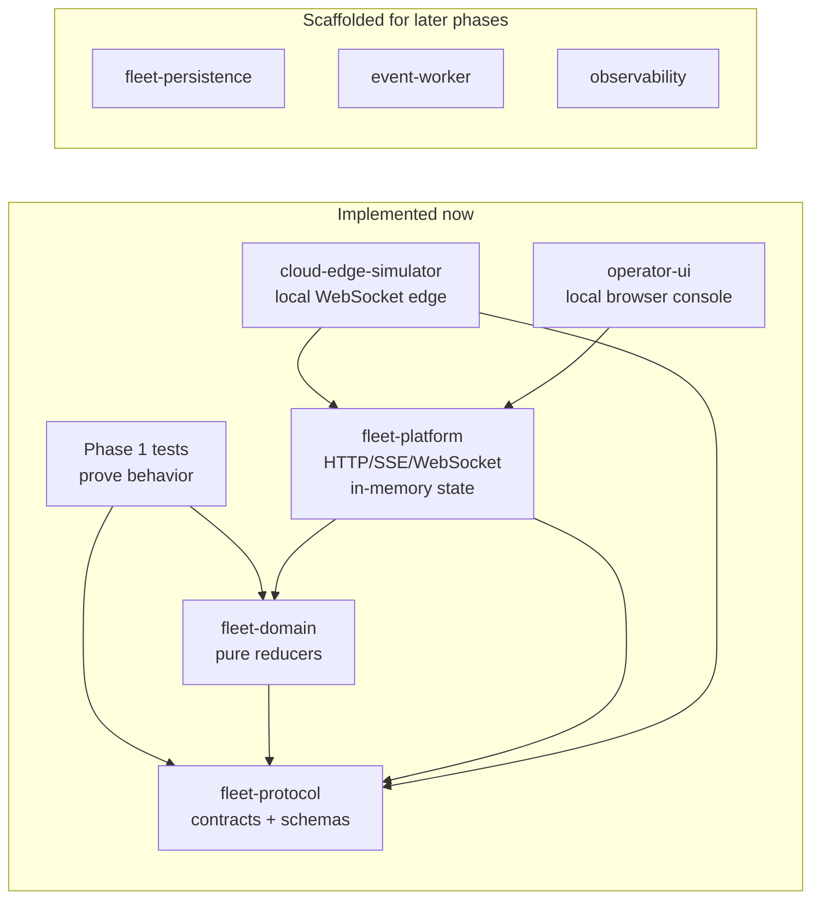
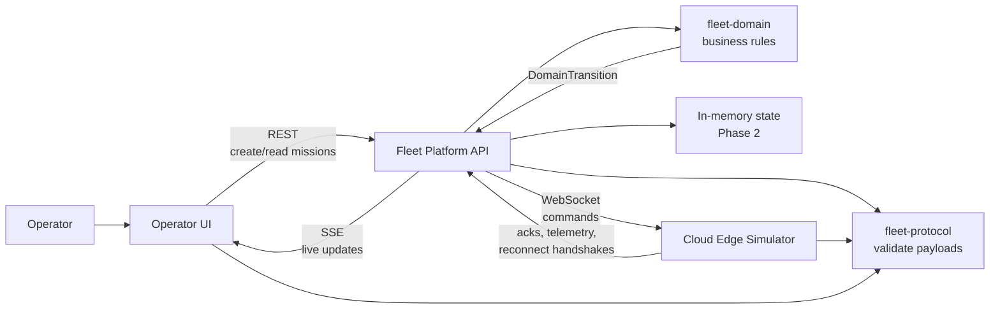
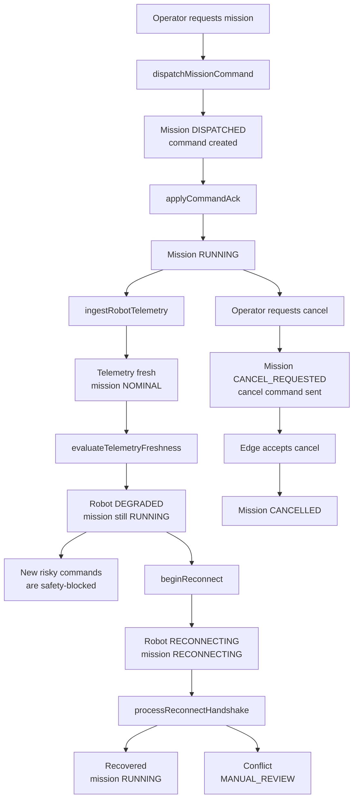
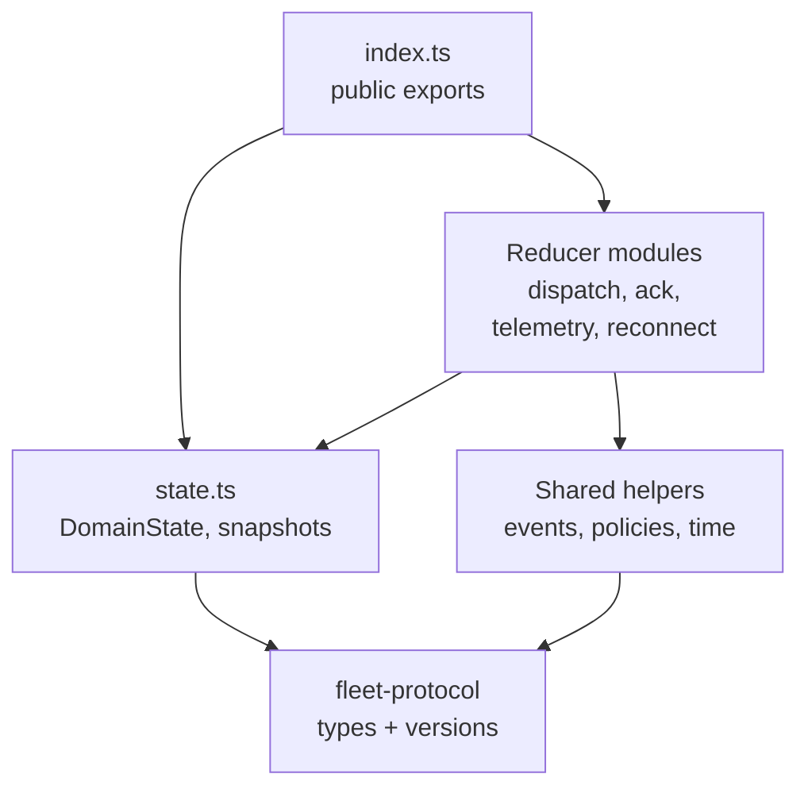

# Current Architecture

Snapshot date: 2026-05-15.

The important thing to know: the domain/protocol core is implemented, and
`apps/fleet-platform` now has the first Phase 2 API/gateway slice.
`apps/cloud-edge-simulator` provides the local edge process needed to drive the
incident demo without ROS 2. `apps/operator-ui` provides the first local
operator console slice for the incident demo.

- `packages/fleet-protocol`: shared message contracts and JSON Schema objects.
- `packages/fleet-domain`: pure domain state machine.
- `packages/test-support`: fake clock/test helpers.
- Phase 1 tests proving the incident path without API, DB, UI, or simulator.
- `apps/fleet-platform`: in-memory HTTP API, SSE stream, edge WebSocket gateway,
  queued command delivery, cancel command flow, and telemetry freshness sweep.
- `apps/cloud-edge-simulator`: outbound WebSocket edge client that sends
  `edge.hello`, accepts `GO_TO_POSE` and `CANCEL_MISSION`, emits accepted acks,
  sends heartbeats, and can simulate stale telemetry or reconnect handshakes.
- `apps/operator-ui`: lightweight TypeScript browser app served by a tiny local
  Node server. It reads Fleet Platform REST state, subscribes to `/stream/events`,
  creates `GO_TO_POSE` missions, cancels selected missions, and highlights
  `ONLINE`, `STALE`, `DEGRADED`, `OFFLINE`, and `RECONNECTING` states. Local
  demo controls are rendered only when explicitly configured with demo mode and
  a demo admin token. Mission creation is disabled while the robot already has
  active work, and blocked/rejected mission rows surface the platform reason.

## What Exists Today

Read this as the current working code, not the final product.



The domain tests still prove the behavior at the pure reducer level. The
fleet-platform tests now prove the first process boundary around that behavior.

## Phase 2 Target

Read this as the next architecture to build.



Phase 2 now has the in-memory platform, a local simulator, and a local Operator
UI. The platform exposes REST/SSE/WebSocket edges and keeps mission decisions
inside `fleet-domain`. Queued commands are delivered after the edge sends
`edge.hello`, which avoids double-delivery between socket upgrade and the first
edge identity message. The simulator connects outbound to
`/edge/connect?robotId=...` and uses the same protocol payloads future ROS 2
edge code must produce.

## Mission Incident Flow

Read this as the story the demo needs to show.



The key modeling point is that stale telemetry changes operational risk. It does
not automatically fail the mission lifecycle. The Fleet Platform runs a
telemetry freshness sweep and also rechecks freshness before dispatching a new
mission command.

## Domain Package Shape

Read this as file ownership inside `packages/fleet-domain/src`.



Use the barrel for app code:

```ts
import {
  createInitialDomainState,
  dispatchMissionCommand,
  applyCommandAck,
  ingestRobotTelemetry,
  evaluateTelemetryFreshness,
  requestMissionCancellation,
  beginReconnect,
  processReconnectHandshake
} from "@roboops/fleet-domain";
```

Only domain modules should import helper files like `events.ts`, `policies.ts`, or `time.ts` directly.

## Phase 2 Build Notes

- Continue in `apps/fleet-platform` and `apps/cloud-edge-simulator`; the first
  API/gateway and local edge slices are implemented.
- Keep a single in-memory `DomainState` behind small repository/service functions.
- Validate incoming command, telemetry, ack, and reconnect payloads using `fleet-protocol`.
- Call `fleet-domain` reducers for state changes.
- Publish reducer-produced `domainEvents` and `auditEvents` to API responses/SSE.
- Keep cancellation as a domain reducer flow:
  `CANCEL_REQUESTED` after operator request, then `CANCELLED` after accepted edge ack.
- Run telemetry freshness evaluation outside demo endpoints so stale robots degrade automatically.
- Keep command delivery separate from UI streaming:
  - REST for operator commands and reads
  - SSE for browser live updates
  - WebSocket for edge commands, acks, telemetry, and reconnect handshakes

## Local Demo Wiring

Run the Fleet Platform on its default local port. Demo admin endpoints are
disabled unless both `DEMO_MODE=true` and `DEMO_ADMIN_TOKEN` are set:

```sh
pnpm --filter @roboops/fleet-platform dev
```

```sh
DEMO_MODE=true \
DEMO_ADMIN_TOKEN=local-demo-token \
pnpm --filter @roboops/fleet-platform dev
```

Run the simulator in a second terminal:

```sh
FLEET_PLATFORM_URL=http://127.0.0.1:4010 \
ROBOT_ID=robot-a \
EDGE_AGENT_VERSION=sim-0.1.0 \
SIM_SCENARIO=normal \
pnpm --filter @roboops/cloud-edge-simulator dev
```

Use `SIM_SCENARIO=stale-telemetry` for the stale heartbeat path, or
`SIM_SCENARIO=reconnect` for the disconnect/handshake/recovery path.

Run the Operator UI in a third terminal and open `http://127.0.0.1:4020`.
Demo controls stay hidden unless `OPERATOR_DEMO_MODE=true` and a demo admin
token are present:

```sh
FLEET_PLATFORM_URL=http://127.0.0.1:4010 \
OPERATOR_ROBOT_ID=robot-a \
pnpm --filter @roboops/operator-ui dev
```

```sh
FLEET_PLATFORM_URL=http://127.0.0.1:4010 \
OPERATOR_ROBOT_ID=robot-a \
OPERATOR_DEMO_MODE=true \
OPERATOR_DEMO_ADMIN_TOKEN=local-demo-token \
pnpm --filter @roboops/operator-ui dev
```

`SIM_SCENARIO=normal` accepts a motion command and keeps telemetry fresh.
`SIM_SCENARIO=stale-telemetry` accepts the command and then stops telemetry so
the platform sweep can mark the robot and active mission degraded.
`SIM_SCENARIO=reconnect` accepts the command, reconnects, sends a reconnect
handshake, and resumes telemetry.

The Operator UI demo controls call the existing `/demo/*` endpoints with the
configured token. `Reset State` replaces in-memory Fleet Platform state with a
clean `robot-a` baseline, and `Start Clean Mission` resets before dispatching
the normal demo `GO_TO_POSE` so prior smoke-test missions do not confuse the
demo.
